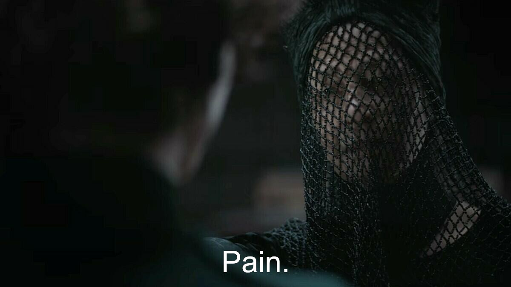

# What's in the .GM1 file?

## Introduction

The .h3m file format used for maps for Heroes of Might and Magic 3 is compact, elegant and easy to understand.

The file format for saved games is none of these things.

This makes sense - .h3m reflects the design of the Map Editor, which is such a great tool that people are still making maps for a game released in 1999. Saved games, on the other hand, were not meant to be modified by users, whether via some program or manually, so the software engineer(s) who designed the file format likely focused on making the saved games load quickly.

Because of this, saved games are not "edit-friendly":
* They contain some junk bytes that are explicitly written even though their values aren't used by the game - I suspect that the game simply maps certain parts of the file into the process memory to simplify deserialization.
* They contain a lot of redundant data - for example, for each tile on the Adventure Map the file stores the list of objects that should be rendered on this tile, even though this information can be derived from the list of objects (which is also stored in the file).
* They contain a lot of duplicate data - for example, the coordinates of an object are often duplicated because the game uses 2 different formats (with and without bit packing).
* Data types are often inconsistent, which likely reflects the mess in the source code of the game.

As a result, things that are trivial to do in the Map Editor can be hard and error-prone for saved games - e.g., moving an object to another location requires updating multiple seemingly unrelated sections of the file.

Nevertheless, there are situations where you might want to read or modify saved games. For example:
* Mapmakers and testers may want to adjust the enemy's hero army.
* Players may want to edit saved games if the map has a bug.
* This can be useful if you want to compute statistics.

Since I reverse-engineered the file format, I thought it would be a nice idea to provide its specification as well.

## Terminology

Unlike maps (.h3m) and campaigns (.h3c), the file format for saved games doesn't have a well-established name. Depending on the number of players, the game uses various filename extensions (.GM1, .GM2, ..., .GM8), but "GM" is a very ambiguous abbreviation.

In this repository I call the file format for saved games **H3SVG** since this is what the game uses as the file signature (the bytes at the beginning of the file).

## Previous work

* [Maurice from HC](http://heroescommunity.com/viewthread.php3?TID=46018) partially reverse-engineered the file format, specifically how properties for objects are encoded within tiles data.
* Chengyu Sun made [Heroes3Editor](https://github.com/cysun/Heroes3Editor), which only allows editing heroes (e.g., their skills, spells, army, artifacts).
* Erki Suurjaak made another editor [h3sed](https://github.com/suurjaak/h3sed), which also only allows editing heroes.
* RoseKavalier reverse-engineered how the game stores data in the process memory and released the library [H3API](https://github.com/RoseKavalier/H3API). While this is different from the file format for saved games, some parts are very similar.

## Versions

This document describes the file format used by the version **42.2** of the game. It's possible that some older versions of the game used a different format for the saved games.

According to Erki Suurjaak, the versions are:
* [16.0; 41.0] - Heroes of Might and Magic 3: The Restoration of Erathia
* 42.1 - Heroes of Might and Magic 3: Armageddon's Blade
* 42.2 - Heroes of Might and Magic 3: The Shadow of Death (maybe up to 43.4)

### Mods

This document describes the file format used by the official game - Heroes of Might and Magic 3: Complete.

It is possible that some mods use a different file format. As customary in HoMM3 modding community, development is predominantly close-sourced, and I have better things to do that reverse-engineering fan-made content.

Notable exceptions:
* [HD mod](https://sites.google.com/site/heroes3hd): the saved games written while playing with HD mod are compatible with the specification here.
* [SoD_SP](https://docs.google.com/document/d/1JlQ6TC97d_Bb1g_sDRpxTvkKHtyXgZ3qORG5LJS8tp8) plugin for the HD mod: versions up to 1.19.4 remain compatible with this specification. However, RoseKavalier has explicitly [stated](http://heroescommunity.com/viewthread.php3?TID=44581&PID=1590134#focus) that the version 1.20 will break compatibility for saved games.

## Compression

Saved games written by the game are GZIP-compressed. GZIP format is specified in [RFC 1952](https://www.rfc-editor.org/rfc/rfc1952), so I'm not going to focus on it - this document addresses the decompressed data.

Note that the game can load decompressed files as well.

TODO: mention broken CRC.

## File format

The description below groups parts of the H3SVG file into typed structures. These structures are written as a sequence of fields; each field itself can be a primitive type, a structure or an array.

**Primitive types:**
| Type        | Size in bytes | Description                                                                      |
| ----------- | ------------- | -------------------------------------------------------------------------------- |
| `char`      | 1             | 1 byte that should be treated as a character                                     |
| `Bool`      | 1             | 1 byte that should be interpreted as Boolean: zero is `false`, nonzero is `true` |
| `int8`      | 1             | signed 8-bit integer (values within [-128; 127])                                 |
| `uint8`     | 1             | unsigned 8-bit integer (values within [0; 255])                                  |
| `int16`     | 2             | signed 16-bit integer (values within [-32768; 32767])                            |
| `uint16`    | 2             | unsigned 16-bit integer (values within [0; 65535])                               |
| `int32`     | 4             | signed 32-bit integer (values within [-2147483648; 2147483647])                  |
| `uint32`    | 4             | unsigned 32-bit integer (values within [0; 4294967295])                          |
| `String16`  | varies        | length-prefixed string: a 16-bit integer N (`uint16`), followed by N bytes       |
| `String32`  | varies        | length-prefixed string: a 32-bit integer N (`uint32`), followed by N bytes       |

Integers are always little-endian in H3SVG. For example, a 32-bit integer 1025 is encoded as 4 bytes `[0x01, 0x04, 0x00, 0x00]`.

Composite data types are described like this:

`Person`:
| Field name  | Type       | Size in bytes | Description        |
| ----------- | ---------- | ------------- | ------------------ |
| name        | `String32` | varies        | Name of the person |
| age         | `uint16`   | 2             | Age (in years)     |

which means that the structure `Person` is written as 2 fields: first, the name is written as `String32`, then the age is written as `uint16`.

`T[N]` indicates an array of N elements of type T: for example, `int32[10]` means an array of 10 signed 32-bit integers.

`?field` indicates a conditionally present field. The description for this field explains when this field is present and when it's not.

An H3SVG file is a single structure that we will naturally call [`SavedGame`](#SavedGame).

### `SavedGame`

| Field name                | Type                             | Size in bytes | Description                                                      |
| ------------------------- | -------------------------------- | ------------- | ---------------------------------------------------------------- |
| file_signature            | `char[5]`                        | 5             | Always equal to "H3SVG"                                          |
| reserved1                 |                                  | 3             | Not used; usually 0s                                             |
| version_major             | `int32`                          | 4             | Major version of the game                                        |
| version_minor             | `int32`                          | 4             | Minor version of the game                                        |
| reserved2                 |                                  | 32            | Not used                                                         |
| map_format                | `int32`                          | 4             | Enum: 14 -> RoE, 21 -> AB, 28 -> SoD                             |
| map_basic_info            | [`MapBasicInfo`](#MapBasicInfo)  | varies        | "Map Specifications / General" in the Map Editor                 |
| players_specs             | [`PlayerSpecs[8]`](#PlayerSpecs) | varies        | "Map Specifications / Player Specs" in the Editor                |
| victory_condition         | `VictoryCondition`               | varies        | "Map Specifications / Special Victory Condition" in the Editor   |
| loss_condition            | `LossCondition`                  | varies        | "Map Specifications / Special Loss Condition" in the Editor      |
| teams                     | [`TeamsInfo`](#TeamsInfo)        | varies        | "Map Specifications / Teams" in the Editor                       |
| num_custom_heroes         | `uint8`                          | 1             | The number of heroes with custom name, portrait or hireability   |
| custom_heroes             | [`CustomHero[num_custom_heroes]`](#CustomHero) | varies | Heroes with custom name, portrait or hireability          |
| unknown1                  | `uint8[16]`                      | 16            | Always [0, 1, 2, 3, 4, 5, 6, 7, 0, 1, 2, 3, 4, 5, 6, 7]          |
| starting_info             | [`ScenarioStartingInfo`](#ScenarioStartingInfo) | 420 | Starting settings for the map                               |
| unknown2                  | `uint8[2]`                       | 2             | Always [0, 0]                                                    |
| original_filename         | `char[47]`                       | 47            | Original filename used for this saved game                       |
| unknown3                  | `uint8[352]`                     | 352           | TODO                                                             |
| disabled_artifacts        | `Bool[144]`                      | 144           | 1 byte per Artifact type indicating if it is disabled            |
| artifacts_bitmask_unknown | `Bool[144]`                      | 144           | TODO                                                             |
| disabled_skills           | `Bool[28]`                       | 28            | 1 byte per Secondary Skill type, indicating if it is disabled    |
| current_rumor             | `String16`                       | varies        | The rumor currently displayed in the Tavern.                     |
| unknown4                  | `Bool[256]`                      | 256           | TODO                                                             |
| num_rumors                | `uint32`                         | 4             | The number of custom rumors added by the mapmaker                |
| rumors                    | [`Rumor[num_rumors]`](#Rumor)    | varies        | "Map Specifications / Rumors" in the Editor                      |
| num_black_markets         | `uint8`                          | 1             | The number of Black Markets on the Adventure Map                 |
| black_markets             | [`BlackMarket[num_black_markets]`](#BlackMarket) | varies | Current state for each Black Market on the map          |
| tiles                     | [`Tile[NUM_TILES]`](#Tile)       | varies        | NUM_TILES = num_levels * map_size * map_size                     |
| num_objects_templates     | `uint32`                         | 4             | The number of templates for objects on the Adventure Map         |
| objects_templates         | [`ObjectTemplate[num_objects_templates]`](#ObjectTemplate) | varies | Templates for objects on the Adventure Map    |
| num_objects               | `uint32`                         | 4             | The number of objects on the Adventure Map                       |
| objects                   | [`Object[num_objects]`](#Object) | varies        | Objects on the Adventure Map                                     |
| object_properties_tables  | `ObjectPropertiesTables`         | varies        | Tables storing properties for objects on the Adventure Map       |
| players                   | [`Player[8]`](#Player)           | 1160          | Current state for each player                                    |
| num_towns                 | `uint8`                          | 1             | The number of towns on the Adventure Map                         |
| towns                     | [`Town[num_towns]`](#Town)       | varies        | Towns on the Adventure Map                                       |
| heroes                    | [`Hero[156]`](#Hero)             | varies        | Properties for each hero                                         |

### `MapBasicInfo`
| Field name     | Type       | Size in bytes | Description                                                 |
| -------------- | ---------- | ------------- | ----------------------------------------------------------- |
| is_playable    | `Bool`     | 1             | 0 if there are no heroes and towns on the map, 1 otherwise  |
| map_size       | `uint32`   | 4             | The width and height of the map (in tiles)                  |
| has_two_levels | `Bool`     | 1             | 0 if there is no subterranean level, 1 otherwise            |
| name           | `String16` | varies        | The name of the map (as set by the mapmaker)                |
| description    | `String16` | varies        | The description of the map (as set by the mapmaker)         |
| difficulty     | `uint8`    | 1             | Enum `MapDifficulty` as suggested by the mapmaker           |
| max_hero_level | `uint8`    | 1             | The maximum allowed level for all heroes                    |

### `PlayerSpecs`
| Field name                  | Type           | Size in bytes | Description                                                                       |
| --------------------------- | -------------- | ------------- | --------------------------------------------------------------------------------- |
| can_be_human                | `Bool`         | 1             | 1 if this player can be controlled by a human, 0 otherwise                        |
| can_be_computer             | `Bool`         | 1             | 1 if this player can be controlled by the computer, 0 otherwise                   |
| behavior                    | `uint8`        | 1             | Enum `PlayerBehavior` as set by the mapmaker                                      |
| allowed_alignments          | `uint8[2]`     | 2             | Bitmask; 1 bit for each town type, indicating if it can be the player's alignment |
| allow_random_alignment      | `Bool`         | 1             | 1 if Random alignment is enabled, 0 otherwise.                                    |
| has_generated_hero          | `Bool`         | 1             | 1 if a hero is generated in the main town for this player, 0 otherwise            |
| ?generated_hero_coordinates | [`Coordinates`](#Coordinates) | 3 | Coordinates of the main town. Only present if has_generated_hero != 0          |
| starting_hero               | [`StartingHero`](#StartingHero) | varies | Information about the starting hero                                     |

### `Coordinates`
| Field name | Type    | Size in bytes | Description                                       |
| ---------- | ------- | ------------- | ------------------------------------------------- |
| x          | `uint8` | 1             | X coordinate                                      |
| y          | `uint8` | 1             | Y coordinate                                      |
| z          | `uint8` | 1             | Z coordinate (0 - above ground, 1 - Subterranean) |

### `StartingHero`
| Field name | Type       | Size in bytes | Description                                           |
| ---------- | ---------- | ------------- | ----------------------------------------------------- |
| type       | `uint8`    | 1             | Enum `HeroType`                                       |
| ?portrait  | `uint8`    | 1             | Enum `HeroPortrait`. Only present if type is not 0xFF |
| ?name      | `String16` | varies        | Only present if type is not 0xFF                      |

### `TeamsInfo`
| Field name       | Type       | Size in bytes | Description                                                                                |
| ---------------- | ---------- | ------------- | ------------------------------------------------------------------------------------------ |
| num_teams        | `uint8`    | 1             | The number of teams                                                                        |
| ?team_for_player | `uint8[8]` | 8             | 1 byte per player, indicating the 0-based index of the team. Only present if num_teams > 0 |

### `CustomHero`
| Field name | Type       | Size in bytes | Description                                                            |
| ---------- | ---------- | ------------- | ---------------------------------------------------------------------- |
| type       | `uint8`    | 1             | Enum `HeroType`                                                        |
| portrait   | `uint8`    | 1             | Enum `HeroPortrait`                                                    |
| name       | `String32` | varies        | The name of the hero                                                   |
| can_hire   | `uint8`    | 1             | Bitmask; 1 bit per player, indicating if the player can hire this hero |

### `ScenarioStartingInfo`
| Field name           | Type                 | Size in bytes | Description                                                            |
| -------------------- | -------------------- | ------------- | ---------------------------------------------------------------------- |
| starting_towns       | `int32[8]`           | 32            | Enum `TownType` for each player; 0xFFFFFFFF is used for absent players |
| unknown1             | `uint8[8]`           | 8             | TODO                                                                   |
| difficulty           | `uint8`              | 1             | Enum `MapDifficulty`; Difficulty level set by the human player         |
| map_filename         | `char[251]`          | 251           | The original filename of the map. Only the characters before the first null terminator are significant. Used by "Restart Scenario" command |
| map_directory        | `char[100]`          | 100           | Relative (to Heroes3.exe) path to the directory in which the original map file is located. Only the characters before the first null terminator are significant. Used by "Restart Scenario" command. The game always writes "maps" here |
| players_control      | `uint8[8]`           | 8             | Enum `PlayerControlType` for each player                               |
| unknown2             | `uint8[3]`           | 3             | Unknown. Seems to always be [255, 1, 1]                                |
| player_turn_duration | `uint8`              | 1             | Enum `PlayerTurnDuration`                                              |
| starting_heroes      | `uint8[8]`           | 8             | Enum `HeroType` for each player                                        |
| starting_bonuses     | `uint8[8]`           | 8             | Enum `PlayerStartingBonus` for each player                             |

### `Rumor`
| Field name     | Type       | Size in bytes | Description                                                            |
| -------------- | ---------- | ------------- | ---------------------------------------------------------------------- |
| text           | `String16` | varies        | Text to display                                                        |
| has_been_shown | `Bool`     | 1             | Indicates whether this rumor has been displayed in the Tavern          |

### `BlackMarket`
| Field name | Type       | Size in bytes | Description                                                            |
| ---------- | ---------- | ------------- | ---------------------------------------------------------------------- |
| artifacts  | `int32[7]` | 28            | Enum `ArtifactType` for each slot. 0xFFFFFFFF is used for empty slots  |

### `Tile`
| Field name            | Type       | Size in bytes | Description                                                                        |
| --------------------- | ---------- | ------------- | ---------------------------------------------------------------------------------- |
| terrain_type          | `uitn8`    | 1             | Enum `TerrainType`                                                                 |
| terrain_sprite        | `uint8`    | 1             | 0-based index of the sprite for `terrain_type` to render on this tile              |
| river_type            | `uint8`    | 1             | Enum `RiverType`                                                                   |
| river_sprite          | `uint8`    | 1             | 0-based index of the sprite for `river_type` to render on this tile                |
| road_type             | `uint8`    | 1             | Enum `RoadType`                                                                    |
| road_sprite           | `uint8`    | 1             | 0-based index of the sprite for `road_type` to render on this tile                 |
| flags                 | `uint8[2]` | 2             | Bitmask; TODO                                                                      |
| object_class          | `uint16`   | 2             | Enum `ObjectClass` - type of the object on this tile.                              |
| object_subclass       | `uint16`   | 2             | TODO                                                                               |
| object_idx            | `uint16`   | 2             | 0-based index of the object in SavedGame.objects, or 0xFFFF if there is no object  |
| object_properties     | `uint8[4]` | 4             | TODO: pain                                                                         |
| num_objects_to_render | `uint32`   | 4             | The number of objects whose sprites overlap with this tile                         |
| objects_to_render     | [`ObjectToRender[num_objects_to_render]`](#ObjectToRender) | varies | Objects whose sprites overlap with this tile |

### `ObjectToRender`
| Field name | Type     | Size in bytes | Description                                                            |
| ---------- | -------- | ------------- | ---------------------------------------------------------------------- |
| object_idx | `uint16` | 2             | 0-based index of the object in SavedGame.objects                       |
| unknown    | `uint16` | 2             | Somehow specified which part of the sprite to render                   |

### `ObjectTemplate`
| Field name      | Type                 | Size in bytes | Description                                            |
| --------------- | -------------------- | ------------- | ------------------------------------------------------ |
| def             | `String16`           | varies        | Filename of the .def sprite from "H3sprite.lod" to use |
| width           | `uint8`              | 1             | Width of the sprite (in tiles)                         |
| height          | `uint8`              | 1             | Height of the sprite (in tiles)                        |
| unknown1        | `SpriteTilesBitmask` | 6             | |
| passability     | `SpriteTilesBitmask` | 6             | |
| unknown2        | `SpriteTilesBitmask` | 6             | |
| actionablility  | `SpriteTilesBitmask` | 6             | |
| object_class    | `uint16`             | 2             | Enum `ObjectClass`; indicates the type of the object   |
| object_subclass | `uint16`             | 2             | Subtype of the object                                  |
| reserved        |                      | 2             | Always [0, 0]                                          |
| is_ground       | `Bool`               | 1             | Indicates whether this object is a part of the ground  |

### `Object`
| Field name   | Type                          | Size in bytes | Description                                                    |
| ------------ | ----------------------------- | ------------- | -------------------------------------------------------------- |
| coordinates  | [`Coordinates`](#Coordinates) | 3             | Coordinates of this object on the Adventure Map                |
| template_idx | `uint16`                      | 2             | 0-based index of the template from SavedGame.objects_tempaltes |

### `ObjectPropertiesTables`
| Field name                  | Type                                | Size in bytes    | Description                                              |
| --------------------------- | ----------------------------------- | ---------------- | -------------------------------------------------------- |
| num_event_objects           | `uint16`                            | 2                | The number of Event and Pandora's Box objects on the map |
| events_and_pandoras_boxes   | [`EventBase[num_event_objects]`](#EventBase) | varies  | Event and Pandora's Box objects on the Adventure Map     |
| num_artifact_objects        | `uint16`                            | 2                | |
| artifacts_and_spell_scrolls | [`Guardians[num_artifact_objects]`](#Guardians) | varies | Artifact and SpellScroll objects on the Adventure Map  |
| num_monster_objects         | `uint16`                            | 2                | |
| monsters                    | [`Monster[num_monster_objects]`](#Monster) | varies    | |
| num_seers_huts              | `uint16`                            | 2                | |
| seers_huts                  | [`SeersHut[num_seers_huts]`](#SeersHut) | varies       | |
| num_quest_guards            | `uint16`                            | 2                | |
| quest_guards                | [`QuestGuard[num_quest_guards]`](#QuestGuard) | varies | |
| num_global_events           | `uint32`                            | 4                | |
| global_events               | [`TimedEvent[num_global_events]`](#TimedEvent)| varies | |
| num_town_events             | `uint32`                            | 4                | |
| town_events                 | [`TownEvent[num_town_events]`](#TownEvent)| varies     | |
| num_signs_and_ocean_bottles | `uint8`                             | 1                | |
| signs_and_ocean_bottles     | [`Sign[num_signs_and_ocean_bottles]`](#Sign) | varies  | |
| num_mines_and_lighthouses   | `uint8`                             | 1                | |
| mines_and_lighthouses       | [`Mine[num_mines_and_lighthouses]`](#Mine) | varies    | |
| num_dwellings               | `uint16`                            | 2                | |
| dwellings                   | [`Dwelling[num_dwellings]`](#Dwelling) | varies        | |
| num_garrisons               | `uint8`                             | 1                | |
| garrisons                   | [`Garrison[num_garrisons]`](#Garrison) | varies        | |
| num_boats                   | `uint8`                             | 1                | The number of boats on the Adventure Map            |
| boats                       | [`Boat[num_boats]`](#Boat)          | varies           | Boats on the Adventure map                          |
| num_obelisks                | `uint8`                             | 1                | The number of Obelisks on the Adventure Map         |
| obelisks                    | [`Obelisk[49]`](#Obelisk)           | 49               | Only the first num_obelisks elements are meaningful |

### `Guardians`
| Field name    | Type                | Size in bytes | Description                        |
| ------------- | ------------------- | ------------- | ---------------------------------- |
| message       | `String16`          | varies        | Text to display                    |
| has_creatures | `Bool`              | 1             |                                    |
| ?creatures    | [`Troops`](#Troops) | 56            | Only present if has_creatures != 0 |

### `Troops`
| Field name      | Type       | Size in bytes | Description                                                           |
| --------------- | ---------- | ------------- | --------------------------------------------------------------------- |
| creature_types  | `int32[7]` | 28            | Enum `CreatureType` for each slot; 0xFFFFFFFF is used for empty slots |
| creature_counts | `int32[7]` | 28            | The number of creatures for each slot                                 |

### `EventBase`
| Field name           | Type                                      | Size in bytes | Description                                             |
| -------------------- | ----------------------------------------- | ------------- | ------------------------------------------------------- |
| has_guardians        | `Bool`                                    | 1             |                                                         |
| ?guardians           | [`Guardians`](#Guardians)                 | varies        | Only present if has_guardians != 0                      |
| experience           | `int32`                                   | 4             | Experience points to give/take                          |
| spell_points         | `int32`                                   | 4             | Spell points to give/take                               |
| morale               | `int8`                                    | 1             | Morale bonus                                            |
| luck                 | `int8`                                    | 1             | Luck bonus                                              |
| resources            | `int32[7]`                                | 28            | The amount to give/take for each Resource type          |
| primary_skills       | `int8[4]`                                 | 4             | Increments/decrements for each Primary Skill type       |
| num_secondary_skills | `uint8`                                   | 1             | The number of Secondary Skills to grant                 |
| secondary_skills     | [`SecondarySkill[num_secondary_skills]`](#SecondarySkill) | varies | Secondary Skills to grant                      |
| num_artifacts        | `uint8`                                   | 1             | The number of artifacts to give                         |
| artifacts            | `uint8[num_artifacts]`                    | varies        | Artifacts to give (each element is enum `ArtifactType`) |
| num_spells           | `uint8`                                   | 1             | The number of spells to give                            |
| spells               | `uint8[num_spells]`                       | varies        | Spells to give (each element is enum `SpellType`)       |
| num_creatures        | `uint8`                                   | 1             | The number of creature stacks to give                   |
| creatures            | [`CreatureStack[num_creatures]`](#CreatureStack) | varies | Creature stacks to give                                 |

### `SecondarySkill`
| Field name | Type    | Size in bytes | Description               |
| ---------- | ------- | ------------- | ------------------------- |
| type       | `uint8` | 1             | Enum `SecondarySkillType` |
| level      | `uint8` | 1             | Level of expertise        |

### `CreatureStack`
| Field name | Type     | Size in bytes | Description                                     |
| ---------- | -------- | ------------- | ----------------------------------------------- |
| type       | `uint16` | 2             | Enum `CreatureType`; 0xFFFF means "no creature" |
| count      | `int16`  | 2             | The number of creatures                         |

### `Monster`
| Field name | Type       | Size in bytes | Description                                        |
| ---------- | ---------- | ------------- | -------------------------------------------------- |
| message    | `String16` | varies        | Message to display                                 |
| resources  | `int32[7]` | 28            | Increments for each Resource type                  |
| artifact   | `uint8`    | 1             | Enum `ArtifactType` or 0xFF if there's no artifact |

### `SeersHut`
| Field name | Type     | Size in bytes | Description                                                                |
| ---------- | -------- | ------------- | -------------------------------------------------------------------------- |
| quest      | `Quest`  | varies        |                                                                            |
| reward     | `Reward` | 12            |                                                                            |
| reserved   |          | 1             | 0 by default; modifying the value seems to have no effect                  |
| visited_by | `uint8`  | 1             | Bitmask; 1 bit per player, indicating if they have visited this Seer's Hut |
| name       | `uint8`  | 1             | Enum `SeerName`                                                            |

### `QuestGuard`
| Field name | Type     | Size in bytes | Description                                                                 |
| ---------- | -------- | ------------- | --------------------------------------------------------------------------- |
| quest      | `Quest`  | varies        |                                                                             |
| visited_by | `uint8`  | 1             | Bitmask; 1 bit per player, indicating if they have visited this Quest Guard |

### `TimedEvent`
| Field name             | Type       | Size in bytes | Description                                                                   |
| ---------------------- | ---------- | ------------- | ----------------------------------------------------------------------------- |
| message                | `String16` | varies        | Text to display                                                               |
| resources              | `int32[7]` | 28            | The amount to give/take for each Resource type                                |
| affected_players       | `uint8`    | 1             | Bitmask; 1 bit per player, indicating if the player is affected by this event |
| applies_to_human       | `Bool`     | 1             |                                                                               |
| applies_to_computer    | `Bool`     | 1             |                                                                               |
| day_of_first_occurence | `uint16`   | 2             | 0 means Month: 1, Week: 1, Day: 1                                             |
| repeat_after_days      | `uint16`   | 2             | Frequency of the event; 0 means that the even does not repeat                 |

### `TownEvent`
| Field name             | Type        | Size in bytes | Description                                                                   |
| ---------------------- | ----------- | ------------- | ----------------------------------------------------------------------------- |
| message                | `String16`  | varies        | Text to display                                                               |
| resources              | `int32[7]`  | 28            | The amount to give/take for each Resource type                                |
| affected_players       | `uint8`     | 1             | Bitmask; 1 bit per player, indicating if the player is affected by this event |
| applies_to_human       | `Bool`      | 1             |                                                                               |
| applies_to_computer    | `Bool`      | 1             |                                                                               |
| day_of_first_occurence | `uint16`    | 2             | 0 means Month: 1, Week: 1, Day: 1                                             |
| repeat_after_days      | `uint16`    | 2             | Frequency of the event; 0 means that the even does not repeat                 |
| unknown1               | `uint8`     | 1             |                                                                               |
| buildings              | `uint8[6]`  | 6             | Bitmask; 1 bit per Town Building type, indicating if it should be built       |
| unknown2               | `uint8[2]`  | 2             |                                                                               |
| creatures              | `uint16[7]` | 14            | The number of new recruits for each creature level                            |

### `Sign`
| Field name | Type        | Size in bytes | Description                                                    |
| ---------- | ----------- | ------------- | -------------------------------------------------------------- |
| message    | `String16`  | varies        | Text to display                                                |
| is_custom  | `Bool`      | 1             | 1 - display `message`, 0 - show random default message instead |

### `Mine`
| Field name  | Type                          | Size in bytes | Description                  |
| ----------- | ----------------------------- | ------------- | ---------------------------- |
| owner       | `uint8`                       | 1             | Enum `PlayerColor`           |
| unknown     | `uint8[2]`                    | 2             |                              |
| creatures   | [`Troops`](#Troops)           | 56            | Creatures guarding this mine |
| coordinates | [`Coordinates`](#Coordinates) | 3             |                              |

### `Garrison`
| Field name       | Type                          | Size in bytes | Description                            |
| ---------------- | ----------------------------- | ------------- | -------------------------------------- |
| owner            | `uint8`                       | 1             | Enum `PlayerColor`                     |
| creatures        | [`Troops`](#Troops)           | 56            |                                        |
| coordinates      | [`Coordinates`](#Coordinates) | 3             |                                        |
| can_remove_units | `Bool`                        | 1             | Indicates whether troops are removable |

### `Dwelling`
| Field name      | Type                          | Size in bytes | Description                                         |
| --------------- | ----------------------------- | ------------- | --------------------------------------------------- |
| owner           | `uint8`                       | 1             | Enum `PlayerColor`                                  |
| object_class    | `uint8`                       | 1             | Enum `ObjectClass`. Should be either 17 or 20       |
| object_subclass | `uint8`                       | 1             | Defines the type of the creatures in this dwelling  |
| creature_types  | `uint8[4]`                    | 4             | Enum `CreatureType` for each slot                   |
| creature_counts | `uint16[4]`                   | 8             | The number of available creatures for each slot     |
| coordinates     | [`Coordinates`](#Coordinates) | 3             | Coordinates on the Adventure Map                    |
| guardians       | [`Troops`](#Troops)           | 56            | Creatures guarding this dwelling                    |
| unknown         | `uint8`                       | 1             |                                                     |

### `Boat`
| Field name      | Type       | Size in bytes | Description                                          |
| --------------- | ---------- | ------------- | ---------------------------------------------------- |
| unknown1        | `uint8[2]` | 2             |                                                      |
| object_subclass | `uint8`    | 1             | Boat style: 0 - Necropolis, 1 - Castle, 2 - Fortress |
| direction       | `uint8`    | 1             | Enum; describes the current direction of the boat    |
| owner           | `uint8`    | 1             | Enum `PlayerColor`                                   |
| owner_hero      | `uint8`    | 1             | Enum `HeroType`                                      |
| is_occupied     | `Bool`     | 1             |                                                      |
| x               | `uint16`   | 2             |                                                      |
| y               | `uint16`   | 2             |                                                      |
| z               | `uint16`   | 2             |                                                      |
| unknown2        | `uint32`   | 4             | TODO. Seems to be coordinates_packed                 |

### `Obelisk`
| Field name | Type    | Size in bytes | Description                                                             |
| ---------- | ------- | ------------- | ----------------------------------------------------------------------- |
| visited_by | `uint8` | 1             | Bitmask; 1 bit per player, indicating if they have visited this Obelisk |

### `Player`
| Field name       | Type        | Size in bytes | Description                                                                             |
| ---------------- | ----------- | ------------- | --------------------------------------------------------------------------------------- |
| player_color     | `uint8`     | 1             | Enum `PlayerColor`                                                                      |
| num_heroes       | `uint8`     | 1             |                                                                                         |
| active_hero      | `uint8`     | 1             | Enum `HeroType` or 0xFF if there's no active hero                                       |
| heroes           | `uint8[8]`  | 8             | Enum `HeroType` for each hero slot; 0xFF is used for empty slots                        |
| heroes_in_tavern | `uint8[2]`  | 2             | Enum `HeroType` for each slot in the Tavern                                             |
| unknown1         | `uint8[10]` | 10            | TODO                                                                                    |
| days_left        | `int8`      | 1             | The number of days left to live without a town, or -1 if the player has at least 1 town |
| num_towns        | `uint8`     | 1             | The number of towns owned by the player                                                 |
| current_town     | `int8`      | 1             | ID of the currently selected town, or -1 if there is none                               |
| towns            | `int8[48]`  | 48            | IDs of towns owned by the player (see Town.id)                                          |
| unknown2         | `uint8[24]` | 24            | TODO                                                                                    |
| resources        | `int32[7]`  | 28            | The current amount for each Resource type                                               |
| mystical_gardens | `uint32`    | 4             | Bitmask; 1 bit per Mystical Garden, indicating if the player has visited it this week   |
| unknown3         | `uint8[4]`  | 4             | TODO                                                                                    |
| corpses          | `uint32`    | 4             | Bitmask; 1 bit per Corpse, indicating if the player has visited it                      |
| lean_tos         | `uint32`    | 4             | Bitmask; 1 bit per Lean To, indicating if the player has visited it                     |
| unknown4         | `uint8[3]`  | 4             | TODO                                                                                    |

### `Town`
| Field name           | Type                          | Size in bytes | Description                                                        |
| -------------------- | ----------------------------- | ------------- | ------------------------------------------------------------------ |
| id                   | `uint8`                       | 1             | 0-based index of this town in SavedGame.towns                      |
| owner                | `uint8`                       | 1             | Enum `PlayerColor`                                                 |
| built_this_turn      | `Bool`                        | 1             | Indicates whether a building has been built in this town this turn |
| unknown1             | `uint8`                       | 1             | |
| type                 | `uint8`                       | 1             | Enum `TownType`                                                    |
| coordinates          | [`Coordinates`](#Coordinates) | 3             | Coordinates of this town on the Adventure Map                      |
| generated_boat_x     | `uint8`                       | 1             | X-coordinate for boats built in this town                          |
| generated_boat_y     | `uint8`                       | 1             | Y-coordinate for boats built in this town                          |
| garrison             | [`Troops`](#Troops)           | 56            | Creatures in the garrison                                          |
| garrisoned_hero      | `uint8`                       | 1             | Enum `HeroType` or 0xFF if there is no garrisoned hero             |
| visiting_hero        | `uint8`                       | 1             | Enum `HeroType` or 0xFF if there is no visiting hero               |
| mage_guild_level     | `uint8`                       | 1             | The current level of the Mage Guild                                |
| unknown2             | `uint8`                       | 1             | |
| name                 | `String16`                    | varies        | Name of this town                                                  |
| recruits_nonupgraded | `uint16[7]`                   | 14            | The number of available non-upgraded creatures for each level      |
| recruits_upgraded    | `uint16[7]`                   | 14            | The number of upgraded creatures for each level                    |
| unknown3             | `uint8[85]`                   | 85            | |
| spells               | `int32[30]`                   | 120           | 6 spells (enum `SpellType`) for each level of the Mage Guild       |
| unknown4             | `uint8[77]`                   | 77            | |

### `Hero`
| Field name              | Type                      | Size in bytes | Description                                                      |
| ----------------------- | ------------------------- | ------------- | ---------------------------------------------------------------- |
| x                       | `int16`                   | 2             | X coordinate of the hero on the Adventure Map                    |
| y                       | `int16`                   | 2             | Y coordinate of the hero on the Adventure Map                    |
| z                       | `int16`                   | 2             | Z coordinate of the hero on the Adventure Map                    |
| is_visible              | `Bool`                    | 1             | Indicates whether the hero is currently visible on the map       |
| coordinates_packed      | `uint32`                  | 4             | Duplicates the coordinates using the packed format               |
| object_class_under      | `uint32`                  | 4             | Enum `ObjectClass` of the object on the same tile under the hero |
| unknown1                | `uint8[7]`                | 7             |                                                                  |
| biography               | `String32`                | varies        | The hero's biography                                             |
| unknown2                | `uint8[113]`              | 113           |                                                                  |
| army                    | [`Troops`](#Troops)       | 56            | Current army                                                     |
| name                    | `char[13]`                | 13            | Only the bytes before the first null terminator are significant  |
| secondary_skills_levels | `uint8[28]`               | 28            | Level for each Secondary Skill type                              |
| secondary_skills_slots  | `uint8[28]`               | 28            | Slot for each Seconadry Skill type                               |
| spells_learned          | `Bool[70]`                | 70            | 1 byte per Spell type indicating if the hero has learned it      |
| spells_available        | `Bool[70]`                | 70            | 1 byte per Spell type indicating if the hero can cast this spell |
| artifacts_equipped      | [`HeroArtifact[19]`](#HeroArtifact) | 152 | Artifact in each slot                                            |
| artifacts_backpack      | [`HeroArtifact[64]`](#HeroArtifact) | 512 | Artifacts in the backpack                                        |
| unknown3                | `uint8[22]`               | 22            |                                                                  |

### `HeroArtifact`
| Field name | Type    | Size in bytes | Description                                                  |
| ---------- | ------- | ------------- | ------------------------------------------------------------ |
| type       | `int32` | 4             | Enum `ArtifactType` or 0xFFFFFFFF if there is no artifact    |
| spell_type | `int32` | 4             | Enum `SpellType`. Only meaningful if type == 1 (SpellScroll) |
